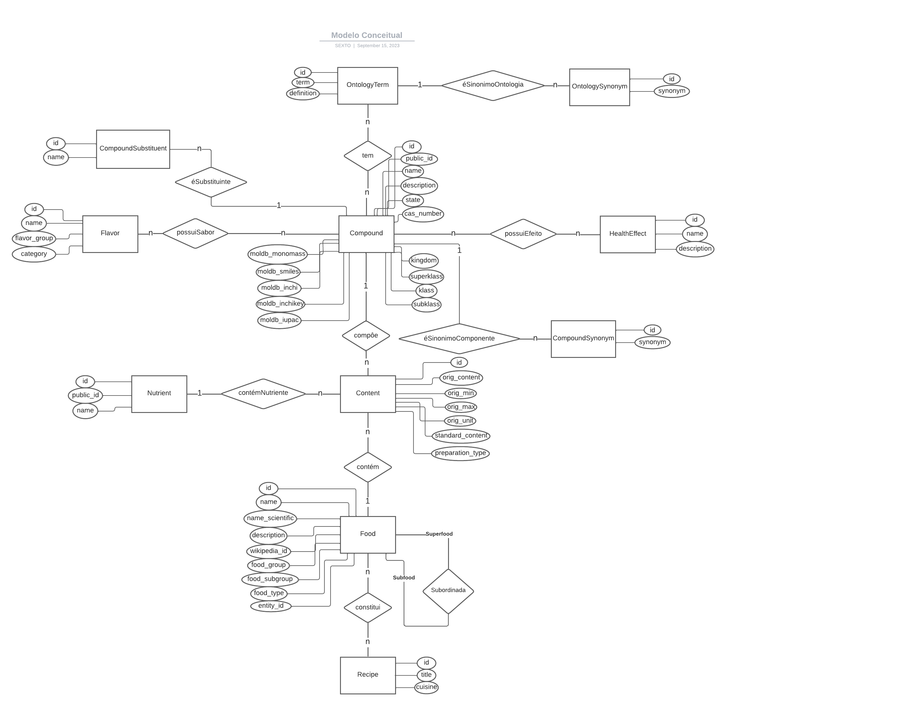

# Modelo para Apresentação do Projeto 1 - Modelo Conceitual e Lógico

## Slides da Apresentação
https://docs.google.com/presentation/d/1VfEVw-f_js4v9XNrYgLxA_2kyP5PK5dlCNg7qiHoRRI/edit?usp=sharing

## Motivação e Contexto

> Muitas vezes, ao acessar receitas na internet, nos sentimos perdidos tentando entender quais são as vantagens e desvantagens de cada ingrediente presente no alimento que vamos preparar. Pensando em otimizar esse processo e condensar informações, nosso projeto tem como objetivo interligar dados de informações sobre os ingredientes com o contexto nos quais eles são utilizados. Pensando nisso, faremos uma relação entre o FooDB, um banco de dados que contém informações sobre ingredientes, com o CulinaryDB, outro banco, responsável por guardar receitas e seus respectivos ingredientes.

## Bases de Dados
> Elencar as bases de dados fonte utilizadas no projeto.

título da base | link | breve descrição
----- | ----- | -----
`FooDB` | `https://www.foodb.ca/` | `Informações sobre a composição dos alimentos`
`CulinaryDB` | `https://cosylab.iiitd.edu.in/culinarydb/` | `Contém receitas, ingredientes e modos de preparo de receitas`

## Modelo Conceitual

> 

## Modelos Lógicos

~~~
CompoundOntologyTerm(id, compound_id, ontology_term_id)
    compound_id chave estrangeira - Compound(id)
    ontology_term_id chave estrangeira - OntologyTerm(id)  
CompoundsFlavor(id, compound_id, flavor_id)
    compound_id chave estrangeira - Compound(id)
    flavor_id chave estrangeira - Flavor(id)  
CompoundsHealthEffect(id, compound_id, health_effect_id, orig_health_effect_name, orig_compound_name)
    compound_id chave estrangeira - Compound(id)
    health_effect_id chave estrangeira - HealthEffect(id)  
Compound(id, public_id, name, state, description, cas_number, moldb_smiles, moldb_inchi, moldb_mono_mass, moldb_inchikey, moldb_iupac, kingdom, superklass, klass, subklass)
OntologySynonym(id, ontology_term_id, synonym)
    ontology_term_id chave estrangeira - OntologyTerm(id)
OntologyTerm(id, term, definition)
HealthEffect(id, name, description)
CompoundSubstituent(id, name, compound_id)
    compound_id chave estrangeira - Compound(id)
Flavor(id, name, flavor_group, category)
Content(id, source_id, source_type, food_id, orig_source_id, orig_content, orig_min, orig_max, orig_unit, standard_content, preparation_type)
    source_id chave estrangeira - Nutrient or Compound(id)
    food_id chave estrangeira - Food(id)
Nutrient(id, public_id, name)
Food(id, name, name_scientific, description, wikipedia_id, food_group, food_subgroup, food_type, entity_id)
Recipe(id, title, cuisine)
Subfood(id, super_food, sub_food)
    super_food chave estrangeira - Food(id)
    sub_food chave estrangeira - Food(id)
RecipeFood(id, original_ingredient, aliased_ingredient, entity_id, recipe_id)
    entity_id chave estrangeira - Food(entity_id)
    recipe_id chave estrangeira - Recipe(id)
~~~

## Perguntas de Pesquisa/Análise

> Liste aqui as perguntas de pesquisa/análise. Nem todas as perguntas precisam de implementação associada. É possível haver perguntas em que a solução é apenas descrita para demonstrar o potencial da base. Abaixo são ilustradas três perguntas, mas pode ser um número maior a critério da equipe.
#### Pergunta/Análise 1
> * Pergunta 1
>   
>   * Explicação sucinta da análise que será feita.

#### Pergunta/Análise 2
> * Pergunta 2
>   
>   * Explicação sucinta da análise que será feita.

#### Pergunta/Análise 3
> * Pergunta 3
>   
>   * Explicação sucinta da análise que será feita.

### Perguntas/Análise Propostas mas Não Implementadas

#### Pergunta/Análise 1
> * Pergunta 1
>   
>   * Explicação em linhas gerais de como a base pode ser usada para responder esta pergunta e a sua relevância.

#### Pergunta/Análise 2
> * Pergunta 2
>   
>   * Explicação em linhas gerais de como a base pode ser usada para responder esta pergunta e a sua relevância.

#### Pergunta/Análise 3
> * Pergunta 3
>   
>   * Explicação em linhas gerais de como a base pode ser usada para responder esta pergunta e a sua relevância.
