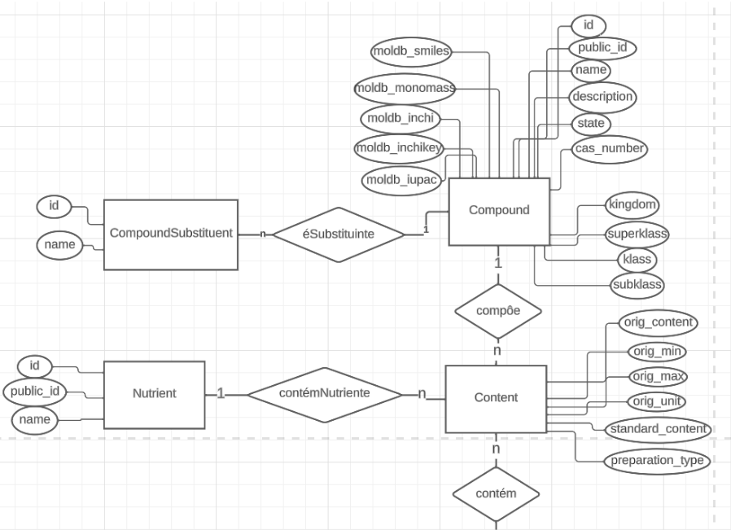
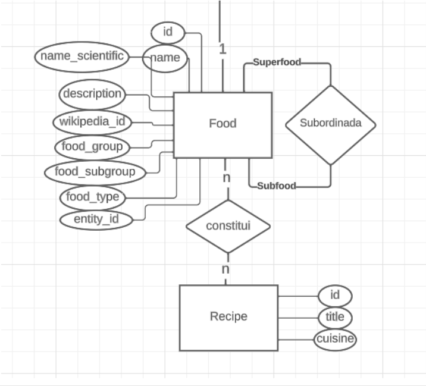

# Apresentação da Entrega Final do Projeto

## Motivação e Contexto

> Muitas vezes, ao acessar receitas na internet, nos sentimos perdidos tentando entender quais são as vantagens e desvantagens de cada ingrediente presente no alimento que vamos preparar. Pensando em otimizar esse processo e condensar informações, nosso projeto tem como objetivo interligar dados de informações sobre os ingredientes com o contexto nos quais eles são utilizados. Pensando nisso, faremos uma relação entre o FooDB, um banco de dados que contém informações sobre ingredientes, com o CulinaryDB, outro banco, responsável por guardar receitas e seus respectivos ingredientes.

## Slides

### Apresentação Prévia
> https://docs.google.com/presentation/d/1VfEVw-f_js4v9XNrYgLxA_2kyP5PK5dlCNg7qiHoRRI/edit?usp=sharing

### Apresentação Final
> https://docs.google.com/presentation/d/1ZImI_HQ-A4fX2wtrOf8TGoKOZlUKDVlN7sbBH0ZUkdU/edit?usp=sharing

## Modelo Conceitual

> 
> 

## Modelos Lógicos

~~~
Compound(id, public_id, name, state, description, cas_number, moldb_smiles, moldb_inchi, moldb_mono_mass, moldb_inchikey, moldb_iupac, kingdom, superklass, klass, subklass)
CompoundSubstituent(id, name, compound_id)
    compound_id chave estrangeira - Compound(id)
Content(id, source_id, source_type, food_id, orig_source_id, orig_content, orig_min, orig_max, orig_unit, standard_content, preparation_type)
    source_id chave estrangeira - Nutrient or Compound(id)
    food_id chave estrangeira - Food(id)
Nutrient(id, public_id, name)
Food(id, name, name_scientific, description, wikipedia_id, food_group, food_subgroup, food_type, entity_id)
Recipe(id, title, cuisine)
Subfood(id, super_food, sub_food)
    super_food chave estrangeira - Food(id)
    sub_food chave estrangeira - Food(id)
RecipeFood(id, original_ingredient, aliased_ingredient, entity_id, recipe_id)
    entity_id chave estrangeira - Food(entity_id)
    recipe_id chave estrangeira - Recipe(id)
~~~

## Dataset Publicado
> Se ao tratar e integrar os dados originais foram produzidas novas bases relacionais ou de grafos, elencar essas bases.

título do arquivo/base | link | breve descrição
----- | ----- | -----
`<título do arquivo/base>` | `<link para arquivo/base>` | `<breve descrição do arquivo/base>`

> Os arquivos finais do dataset publicado devem ser colocados na pasta `data`, em subpasta `processed`. Outros arquivos serão colocados em subpastas conforme seu papel (externo, interim, raw). A diferença entre externo e raw é que o raw é em formato não adaptado para uso. A pasta `raw` é opcional, pois pode ser substituída pelo link para a base original da seção anterior.
> Coloque arquivos que não estejam disponíveis online e sejam acessados pelo notebook. Relacionais (usualmente CSV), XML, JSON e CSV ou triplas para grafos.
> Este é o conjunto mínimo de informações que deve constar na disponibilização do Dataset, mas a equipe pode enriquecer esta seção.

## Bases de Dados

título da base | link | breve descrição
----- | ----- | -----
`FooDB` | `https://www.foodb.ca/` | `Informações sobre a composição dos alimentos`
`CulinaryDB` | `https://cosylab.iiitd.edu.in/culinarydb/` | `Contém receitas, ingredientes e modos de preparo de receitas`

## Detalhamento do Projeto
> Apresente aqui detalhes do processo de construção do dataset e análise. Nesta seção ou na seção de Perguntas podem aparecer destaques de código como indicado a seguir. Note que foi usada uma técnica de highlight de código, que envolve colocar o nome da linguagem na abertura de um trecho com `~~~`, tal como `~~~python`.
> Os destaques de código devem ser trechos pequenos de poucas linhas, que estejam diretamente ligados a alguma explicação. Não utilize trechos extensos de código. Se algum código funcionar online (tal como um Jupyter Notebook), aqui pode haver links. No caso do Jupyter, preferencialmente para o Binder abrindo diretamente o notebook em questão.

~~~python
df = pd.read_excel("/content/drive/My Drive/Colab Notebooks/dataset.xlsx");
sns.set(color_codes=True);
sns.distplot(df.Hemoglobin);
plt.show();
~~~

> Se usar Orange para alguma análise, você pode apresentar uma captura do workflow, como o exemplo a seguir e descrevê-lo:

> Coloque um link para o arquivo do notebook, programas ou workflows que executam as operações que você apresentar.

> Aqui devem ser apresentadas as operações de construção do dataset:
* extração de dados de fontes não estruturadas como, por exemplo, páginas Web
* agregação de dados fragmentados obtidos a partir de API
* integração de dados de múltiplas fontes
* tratamento de dados
* transformação de dados para facilitar análise e pesquisa

> Se for notebook, ele estará dentro da pasta `notebook`. Se por alguma razão o código não for executável no Jupyter, coloque na pasta `src` (por exemplo, arquivos do Orange ou Cytoscape). Se as operações envolverem queries executadas atraves de uma interface de um SGBD não executável no Jupyter, como o Cypher, apresente na forma de markdown.

## Evolução do Projeto
> Relatório de evolução, descrevendo as evoluções na modelagem do projeto, dificuldades enfrentadas, mudanças de rumo, melhorias e lições aprendidas. Referências aos diagramas, modelos e recortes de mudanças são bem-vindos.
> Podem ser apresentados destaques na evolução dos modelos conceitual e lógico. O modelo inicial e intermediários (quando relevantes) e explicação de refinamentos, mudanças ou evolução do projeto que fundamentaram as decisões.
> Relatar o processo para se alcançar os resultados é tão importante quanto os resultados.

## Perguntas de Pesquisa/Análise Combinadas e Respectivas Análises

> Apresente os resultados da forma mais rica possível, com gráficos e tabelas. Mesmo que o seu código rode online em um notebook, copie para esta parte a figura estática. A referência a código e links para execução online pode ser feita aqui ou na seção de detalhamento do projeto (o que for mais pertinente).

> Liste aqui as perguntas de pesquisa/análise e respectivas análises. Nem todas as perguntas precisam de queries que as implementam. É possível haver perguntas em que a solução é apenas descrita para demonstrar o potencial da base. Abaixo são ilustradas três perguntas, mas pode ser um número maior a critério da equipe.
>
### Perguntas/Análise com Resposta Implementada

> As respostas às perguntas podem devem ser ilustradas da forma mais rica possível com tabelas resultantes, grafos ou gráficos que apresentam os resultados. Os resultados podem ser analisados e comentados. Veja um exemplo de figura ilustrando uma comunidade detectada no Cytoscape:

> 

#### Pergunta/Análise 1
> * Pergunta 1
>   
>   * Explicação sucinta da análise que será feita e conjunto de queries que
>     responde à pergunta.

#### Pergunta/Análise 2
> * Pergunta 2
>   
>   * Explicação sucinta da análise que será feita e conjunto de queries que
>     responde à pergunta.

#### Pergunta/Análise 3
> * Pergunta 3
>   
>   * Explicação sucinta da análise que será feita e conjunto de queries que
>     responde à pergunta.

### Perguntas/Análise Propostas mas Não Implementadas

#### Pergunta/Análise 1
> * Pergunta 1
>   
>   * Explicação em linhas gerais de como a base pode ser usada para responder esta pergunta e a sua relevância.

#### Pergunta/Análise 2
> * Pergunta 2
>   
>   * Explicação em linhas gerais de como a base pode ser usada para responder esta pergunta e a sua relevância.

#### Pergunta/Análise 3
> * Pergunta 3
>   
>   * Explicação em linhas gerais de como a base pode ser usada para responder esta pergunta e a sua relevância.

> Coloque um link para o arquivo do notebook que executa o conjunto de queries. Ele estará dentro da pasta `notebook`. Se por alguma razão o código não for executável no Jupyter, coloque na pasta `src`. Se as queries forem executadas atraves de uma interface de um SGBD não executável no Jupyter, como o Cypher, apresente na forma de markdown.