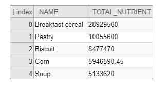
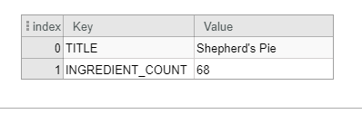
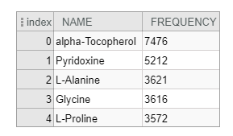
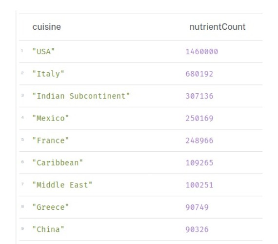
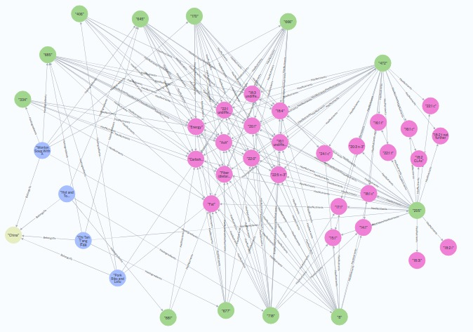
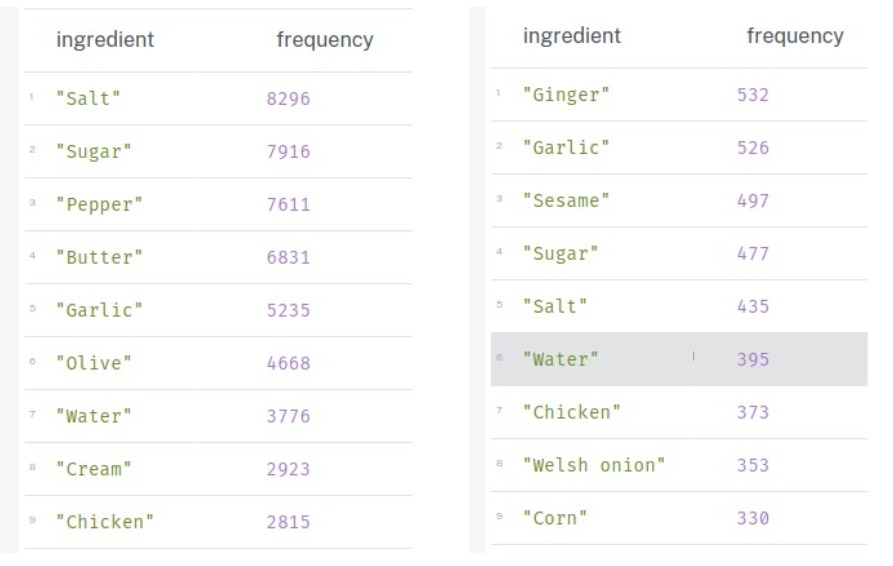
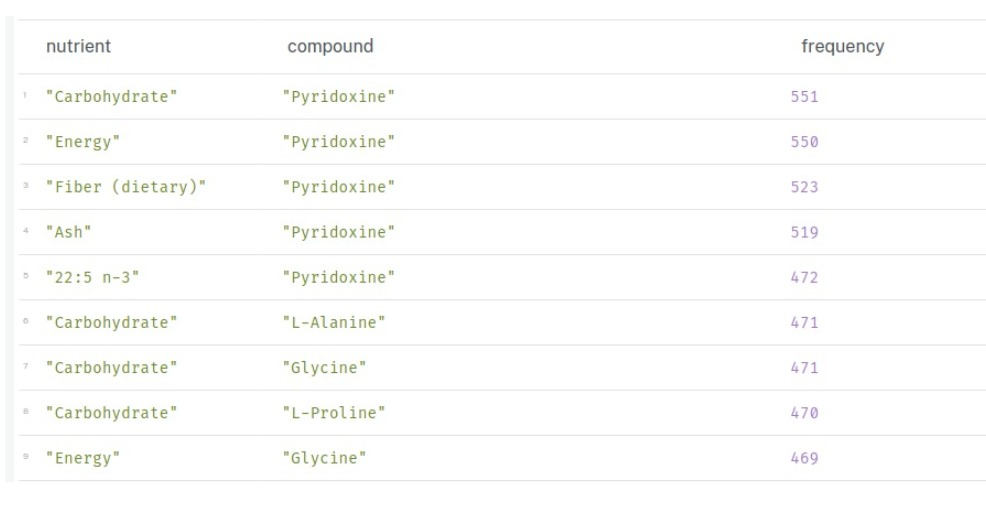

# Apresentação da Entrega Final do Projeto

## Motivação e Contexto

> Muitas vezes, ao acessar receitas na internet, nos sentimos perdidos tentando entender quais são as vantagens e desvantagens de cada ingrediente presente no alimento que vamos preparar. Pensando em otimizar esse processo e condensar informações, nosso projeto tem como objetivo interligar dados de informações sobre os ingredientes com o contexto nos quais eles são utilizados. Pensando nisso, faremos uma relação entre o FooDB, um banco de dados que contém informações sobre ingredientes, com o CulinaryDB, outro banco, responsável por guardar receitas e seus respectivos ingredientes.

## Slides

### Apresentação Prévia
> (assets/Apresentação%20SEXTO%20-%20project1.pdf)

### Apresentação Final
> (assets/MC536%20-%20Sexteto%20Sinistro.pdf)

## Modelo Conceitual

> 
> 

## Modelos Lógicos

~~~
ContentCompound(id, source_id, food_id, orig_source_id, orig_content, orig_unit, standard_content, preparation_type)
    source_id chave estrangeira - Compound(id)
    food_id chave estrangeira - Food(id)

ContentNutrient(id, source_id, food_id, orig_source_id, orig_content, orig_unit, standard_content, preparation_type)
    source_id chave estrangeira - Nutrient(id)
    food_id chave estrangeira - Food(id)

Compound(id, public_id, name, state, description)

Nutrient(id, public_id, name)

Food(id, name, name_scientific, description, wikipedia_id, food_group, food_subgroup, food_type, entity_id, food_id)

Recipe(id, title, cuisine)

RecipeFood(id, original_ingredient, aliased_ingredient, entity_id, recipe_id)
    entity_id chave estrangeira - Food(entity_id)
    recipe_id chave estrangeira - Recipe(id)
~~~

## Dataset Publicado
> Se ao tratar e integrar os dados originais foram produzidas novas bases relacionais ou de grafos, elencar essas bases.

título do arquivo/base | link | breve descrição
----- | ----- | -----
`CulinaryDBCuisines` | `project-final\data\processed\culinarydb_cuisines.csv` | `<breve descrição do arquivo/base>`
`filtered_culinarydb_recipe_details` | `project-final\data\processed\filtered_culinarydb_recipe_details.csv` | `<breve descrição do arquivo/base>`
`filtered_culinarydb_recipe_ingredients` | `project-final\data\processed\filtered_culinarydb_recipe_ingredients.csv` | `<breve descrição do arquivo/base>`
`filtered_foodb_compound` | `project-final\data\processed\filtered_foodb_compound.csv` | `<breve descrição do arquivo/base>`
`filtered_foodb_content_compound` | `project-final\data\processed\filtered_foodb_content_compound.csv` | `<breve descrição do arquivo/base>`
`filtered_foodb_content_nutrient` | `project-final\data\processed\filtered_foodb_content_nutrient.csv` | `<breve descrição do arquivo/base>`
`filtered_foodb_nutrient` | `project-final\data\processed\filtered_foodb_nutrient.csv` | `<breve descrição do arquivo/base>`
`sexto_content_compound` | `project-final\data\processed\sexto_content_compound.csv` | `<breve descrição do arquivo/base>`
`sexto_content_nutrient` | `project-final\data\processed\sexto_content_nutrient.csv` | `<breve descrição do arquivo/base>`
`sexto_ingredient` | `project-final\data\processed\sexto_ingredient.csv` | `<breve descrição do arquivo/base>`

## Bases de Dados

título da base | link | breve descrição
----- | ----- | -----
`FooDB` | `https://www.foodb.ca/` | `Informações sobre a composição dos alimentos`
`CulinaryDB` | `https://cosylab.iiitd.edu.in/culinarydb/` | `Contém receitas, ingredientes e modos de preparo de receitas`

## Detalhamento do Projeto

<h3>1. Extração de Dados </h3>

Primeiramente, tivemos que baixar todos os dados que seriam utilizados nesse projeto. Para isso, utilizamos as bases de dados indicadas na seção [Bases de Dados](#bases-de-dados).

<h3>2. Integração de Dados de Múltiplas Fontes </h3>

Dado as nossas bases, optamos por unificar a tabela `Food` do FooDB com a tabela `Ingredients` do CulinaryDB. No entanto, como estávamos manipulando duas bases independentes e diferentes, haviam alguns alimentos que estavam em uma base e que não estavam em outra, bem como alimentos que eram os mesmos, porém que estavam escritos de formas diferentes, dificultando a nossa integração. Dessa maneira, através do script abaixo, conseguimos filtrar aqueles alimentos que pertencem a ambas as bases de dados, para garantir que não houvesse inconsistência na nossa base unificada de dados.

~~~python
culinarydb_aliased_ingredient_name = culinarydb_ingredients['Aliased Ingredient Name'].tolist()
foodb_name = foodb_food['name'].tolist()

# Create an empty dictionary to store the matches
matches = {}

# Loop through the culinary ingredients
for ingredient in culinarydb_aliased_ingredient_name:
    # Use fuzzywuzzy to find the closest match in the foodb ingredients
    match, score = process.extractOne(ingredient, foodb_name)

    # You might want to set a threshold for the score to make sure the matches are accurate
    if score > 70 and abs(len(ingredient) - len(match)) < 3:
        matches[ingredient] = match
~~~
> Pedaço principal de código onde ocorre os matches de nomes de comidas/ingredientes. Bibliotecas utilizadas: fuzzywuzzy e pandas

<h3>3. Tratamento de Dados </h3>

Com o uso do mesmo código acima, apenas com algumas modificações, tivemos que reduzir o número de registros dos arquivos `.csv` utilizados, uma vez que algumas bases tinham mais de 500 Mb de dados, o que prejudicaria o funcionamento do projeto. Dessa forma, acabamos por remover registros que tinham muitas colunas vazias, bem como filtramos os demais arquivos pelo nome dos alimentos que estavam contidos nas duas bases de dados.

<h3>4. Transformação de Dados </h3>

Depois de todas as etapas anteriores, os dados já estavam bem tratados para fazermos as análises em cada modelo (tabular e em grafo). Faltavam, no entanto, algumas convenções para deixarmos as bases mais consistenes, como, por exemplo, adicionar campos de id `primary key` em formato UUID para tabelas que tinham referências para vários campos de ID's. 

* transformação de dados para facilitar análise e pesquisa

## Evolução do Projeto

<h3>1. Começo </h3>

No começo do projeto, tínhamos uma noção bem curta das bases que mexeríamos. Pensávamos que seria uma integração mais simple e mais direta através do nome de cada alimento. Tínhamos montado um modelo ER mais complexo e mais estruturado, o mesmo que foi apresentado na primeira versão do projeto.

<h3>2. Dificuldades Encontradas </h3>

Assim que começamos a nos aprofundar nas bases e nos arquivos que as formavam, percebemos que haviam muitas inconsistências entre elas, como, por exemplo, a mesma comida escrita de formas diferentes (`Egg` e `Eggs`) e a presença e ausência de registros entre as bases. Tendo isso em mente, já começamos a buscar formas para integrarmos as duas bases de uma maneira prática e rápida. Foi aí que encontramos a biblioteca `fuzzywuzzy`, que, juntamente com a lib `pandas`, nos possibilitaram filtrar os registros que pertenciam tanto a FooDB quanto a CulinaryDB. Dessa maneira, executamos o script presente em `notebooks/Filter_SEXTO.ipynb` para todos os arquivos de dados - alguns mais de uma vez - e obtivemos, praticamente, todos os dados que seriam utilizados no nosso projeto. Além disso, ao realizar as análises para as perguntas, encontramos muitas dificuldades com as ferramentas que estávamos utilizando, seja para fazer o setup inicial de cada software (`Binder/Jupyter` e `Neo4j`), ou para construir as queries, muito devido à falta de experiência que tínhamos no uso das ferramentas

<h3>3. Evoluções na Modelagem e Mudanças de Rumo </h3>

Com os dados devidamente tratados, vimos que algumas tabelas não faziam mais sentido nos nossos modelos, visto que elas não tinham nenhuma relação com as demais. Portanto, as removemos tanto do modelo conceitual, quanto do modelo lógico relacional.

<h3>4. Melhorias e Lições Aprendidas </h3>

Para finalizar, durante o período de análises, aprendemos o quão complexas e impraticáveis algumas consultas podem ser, seja em Cypher ou em SQL, dado o grande volume de informações. Por mais otimizadas que elas possam ser, os nossos ambientes (máquinas) não foram capazes de executar todas as perguntas propostas. Assim, tivemos que adaptar as nossas análises para casos que pudessem ser respondidos.

## Perguntas de Pesquisa/Análise Combinadas e Respectivas Análises

Considerando as limitações, o grau de dificuldade de cada modelo e o nosso nível de experiência com cada um, adotamos perguntas diferentes para cada um dos modelos.

### Perguntas/Análise para o Modelo Tabular (SQL)

#### Pergunta/Análise 1
> Quais são os 5 alimentos mais ricos em um determinado nutriente?

#### Pergunta/Análise 2
> Qual é a receita mais complexa (ou seja, a que tem mais ingredientes)?
 

#### Pergunta/Análise 3
> Quais são os 5 compostos mais comuns encontrados nos alimentos?

### Perguntas/Análise para o Modelo em Grafo (Cypher)

#### Pergunta/Análise 1
> Qual região tem a maior variedade nutritiva?

Tabela | Grafo
----- | -----
 | 

#### Pergunta/Análise 2
> Quais os ingredientes mais comuns uma região?

#### Pergunta/Análise 3
> Quais são as combinações mais comuns de Componentes e Nutrientes?

~~~cypher
LOAD CSV WITH HEADERS FROM 'https://raw.githubusercontent.com/DudaElias/MC536-SEXTO/main/project-final/data/processed/sexto_ingredient.csv' AS line
CREATE (:Ingredients {culinarydb_ingredient_id: line.culinarydb_ingredient_id, foodb_id: line.foodb_id , name_ingredient: line.name});

LOAD CSV WITH HEADERS FROM ' https://raw.githubusercontent.com/DudaElias/MC536-SEXTO/main/project-final/data/processed/filtered_culinarydb_recipe_details.csv' AS line
CREATE (:Recipe {recipe_code: line.recipe_id, recipe_name: line.Title});

LOAD CSV WITH HEADERS FROM 'https://raw.githubusercontent.com/DudaElias/MC536-SEXTO/main/project-final/data/processed/filtered_foodb_compound.csv' AS line
CREATE (:Compounds {compound_code: line.id, compound_name: line.name});

LOAD CSV WITH HEADERS FROM 'https://raw.githubusercontent.com/DudaElias/MC536-SEXTO/main/project-final/data/processed/filtered_foodb_nutrient.csv' AS line
CREATE (:Nutrients {nutrient_code: line.id, nutrient_name: line.name});

LOAD CSV WITH HEADERS FROM 'https://raw.githubusercontent.com/DudaElias/MC536-SEXTO/main/project-final/data/processed/culinarydb_cuisines.csv' AS line
CREATE (:RegionalCuisine {region_name: line.Cuisine});

create index for (r:Recipe) on r.recipe_code;
create index for (i:Ingredients) on i.ingredient_code;
create index for (c:Compounds) on c.compound_code;
create index for (n:Nutrients) on n.nutrient_code;
create index for (r:RegionalCuisine) on r.region_name;

LOAD CSV WITH HEADERS FROM "https://raw.githubusercontent.com/DudaElias/MC536-SEXTO/main/project-final/data/processed/filtered_culinarydb_recipe_ingredients.csv" AS line
MATCH (r:Recipe {recipe_code: line.recipe_id})
MATCH (i:Ingredients {culinarydb_ingredient_id: line.culinarydb_ingredient_id})
MERGE  (r)-[h:HasIngredients]->(i)
ON CREATE SET h.weight=1
ON MATCH SET h.weight=h.weight+1;

LOAD CSV WITH HEADERS FROM "https://raw.githubusercontent.com/DudaElias/MC536-SEXTO/main/project-final/data/processed/filtered_foodb_content_nutrient.csv" AS line
MATCH (n:Nutrients {nutrient_code: line.source_id})
MATCH (i:Ingredients {foodb_id: line.food_id})
MERGE   (i)-[h:HasNutrients]->(n)
ON CREATE SET h.weight=1
ON MATCH SET h.weight=h.weight+1;

LOAD CSV WITH HEADERS FROM 'https://raw.githubusercontent.com/DudaElias/MC536-SEXTO/main/project-final/data/processed/filtered_foodb_content_compound.csv' AS line
MATCH (c:Compounds {compound_code: line.source_id})
MATCH (i:Ingredients {foodb_id: line.food_id})
MERGE  (i)-[h:HasCompound]->(c)
ON CREATE SET h.weight=1
ON MATCH SET h.weight=h.weight+1;

LOAD CSV WITH HEADERS FROM 'https://raw.githubusercontent.com/DudaElias/MC536-SEXTO/main/project-final/data/processed/filtered_culinarydb_recipe_details.csv' AS line
MATCH (c:RegionalCuisine {region_name: line.Cuisine})
MATCH (r:Recipe {recipe_code: line.recipe_id})
CREATE (r)-[:BelongsTo]->(c);

MATCH (
    c:RegionalCuisine)-[:BelongsTo]-
    (r:Recipe)-[:HasIngredients]-
    (i:Ingredients)-[:HasNutrients]-
    (n:Nutrients)
RETURN c.region_name AS cuisine, count(n) AS nutrientCount
ORDER BY nutrientCount DESC

MATCH (
    c:RegionalCuisine {region_name: 'China'})-[b:BelongsTo]-
    (r:Recipe)-[j:HasIngredients]-
    (i:Ingredients)-[h:HasNutrients]-
    (n:Nutrients)
RETURN n, h, i, b, r, c, j
LIMIT 200

MATCH (
    c:RegionalCuisine {region_name: 'USA'})-[:BelongsTo]-
    (r:Recipe)-[:HasIngredients]-
    (i:Ingredients)
RETURN i.name_ingredient AS ingredient, COUNT(i) AS frequency
ORDER BY frequency DESC
LIMIT 10;

MATCH (
    c:RegionalCuisine {region_name: 'China'})-[:BelongsTo]-
    (r:Recipe)-[:HasIngredients]-
    (i:Ingredients)
RETURN i.name_ingredient AS ingredient, COUNT(i) AS frequency
ORDER BY frequency DESC
LIMIT 10;

MATCH (i:Ingredients)-[:HasNutrients]->(n:Nutrients)
MATCH (i)-[:HasCompound]->(c:Compounds)
RETURN n.nutrient_name AS nutrient, c.compound_name AS compound, COUNT(i) AS frequency
ORDER BY frequency DESC
LIMIT 10;
~~~
